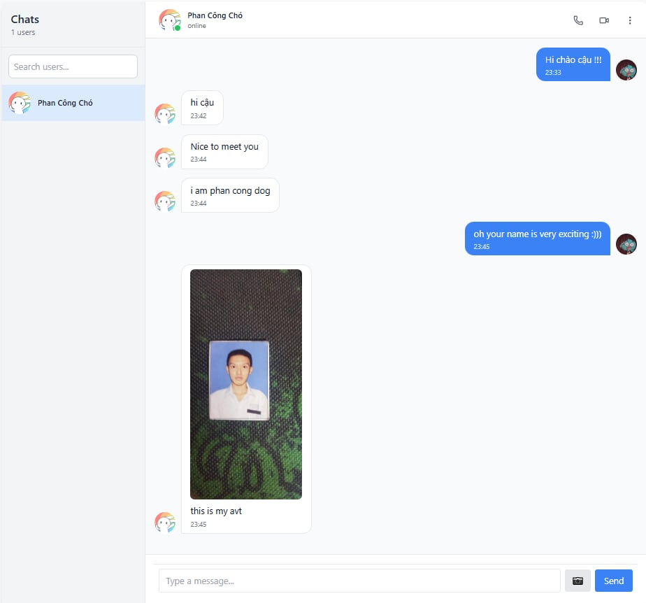
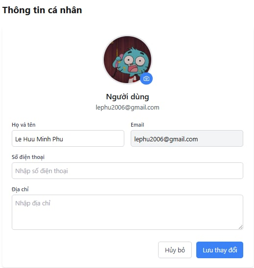

# 💬 CHAT-APP

Một ứng dụng chat thời gian thực sử dụng **React**, **Node.js**, **Tailwind CSS** và **Socket.IO**.  
Hỗ trợ gửi tin nhắn, hình ảnh và quản lý người dùng.

---

## 🚀 Tính năng nổi bật

- Gửi/nhận tin nhắn thời gian thực
- Hỗ trợ gửi hình ảnh
- Quản lý danh sách người dùng
- Chat riêng tư và nhóm (nếu có)
- Giao diện responsive, tối ưu cho desktop và mobile

---

##  Ảnh minh họa

### Giao diện đăng nhập


### Chat thời gian thực


### Demo gửi tin nhắn (GIF)


---

##  Công nghệ sử dụng

- **Frontend:** React, Tailwind CSS, React Router  
- **Backend:** Node.js, Express.js  
- **Realtime:** Socket.IO  
- **Database:** MongoDB  
- **Quản lý trạng thái:** Zustand  

---

##  Cài đặt

### 1. Clone repo

```bash
https://github.com/lephu2k6/CHAT-APP.git
cd CHAT-APP

# Frontend
cd frontend
npm install

# Backend
cd ../backend
npm install

# Backend
npm run dev

# Frontend
cd ../frontend
npm run dev

